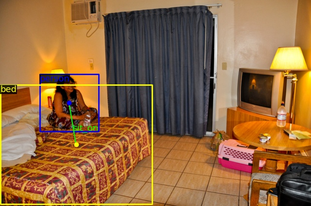

<div align="center">
  
</div>

## Introduction

This repo is used to implement HOI Detection method. 

## Update
- [x] Browse the HICO-Det with the `./tools/mics/browse_dataset.py` 
- [ ] Reimplement [QPIC](https://arxiv.org/abs/2103.05399) (CVPR 2021).

## Installation

This codebase is based on mmdetection(v2.16.0). Please refer to [INSTALL.md](./docs/INSTALL.md) for installation and dataset preparation.

## Usage

### Browse the dataset

```shell
python tools/misc/browse_dataset.py configs/qpic/qpic_r50_150e_hico.py --output-dir ./results/hico-det
```

## Note

- To avoid re-registry a same name module in other OpenMMlab project, MMHOIDet renames the registry like `PIPELINES`->`HOI_PIPELINES`, `DATASETS`->`HOI_DATASETS`
